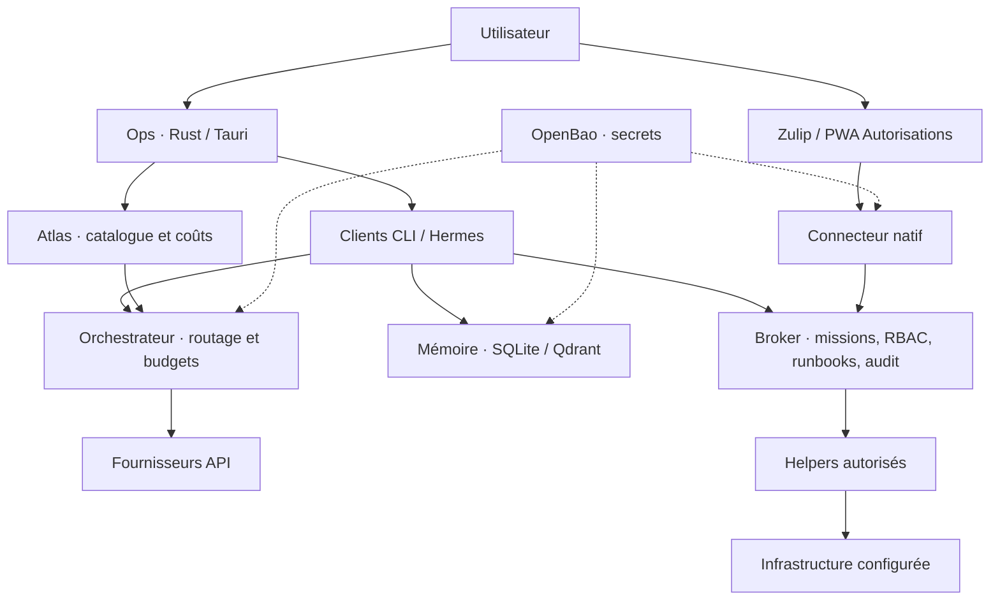

# Ops Control Plane

**Un centre de pilotage Linux pour les opérations assistées par IA, avec supervision humaine, mémoire persistante et actions traçables.**

Ops Control Plane rassemble une application Rust/Tauri, un broker d’opérations, une mémoire partagée, un routeur de modèles et des intégrations avec Zulip, OpenBao et Hermes. Développé par **LOUIS DELEZ**, le code original est publié sous [licence MIT](LICENSE).

> **En développement.** Cette publication fournit les sources et des configurations d’exemple. Elle ne constitue pas un installateur universel. Consulter les [limites et travaux restants](docs/status.md).

## Fonctionnalités

- **Missions supervisées** : runbooks autorisés, contrôle des rôles, approbations et journal d’audit.
- **Mémoire persistante** : catalogue SQLite, index Qdrant, sources datées et passages de relais entre sessions.
- **Routage IA** : sélection par rôle, plafonds d’appels et de coûts, catalogue et suivi des fournisseurs.
- **Application de bureau** : Atlas, Zulip, OpenBao, Hermes et terminaux Codex/Claude Code dans une interface Tauri.
- **Autorisations web** : pont Zulip et application installable avec prise en charge Web Push.
- **Récupération** : outils de sauvegarde, restauration isolée et contrôle de continuité.

Les permissions sont vérifiées par les services. Un message de modèle ou un souvenir n’accorde aucun droit d’exécution. Les secrets sont consommés par les identités de service via OpenBao.

## Architecture



Les vues de bureau affichent les interfaces web natives. Chaque service conserve son authentification.

## Organisation

| Répertoire | Rôle |
| --- | --- |
| [`apps/ops-desktop/`](apps/ops-desktop/) | Application Rust/Tauri et terminaux |
| [`apps/model-manager/`](apps/model-manager/) | Atlas : catalogue et simulations |
| [`apps/approvals/`](apps/approvals/) | Autorisations et Web Push |
| [`broker/`](broker/) | Missions, actions, permissions et audit |
| [`memory/`](memory/) | Mémoire persistante et recherche |
| [`orchestrator/`](orchestrator/) | Routage, budgets et fournisseurs |
| [`native_ops/`](native_ops/) | Connecteurs, pilote CLI et continuité |
| [`bridges/zulip/`](bridges/zulip/) | Pont d’approbation Zulip |
| [`provider-discovery/`](provider-discovery/) | Collecte de catalogues fournisseurs |
| [`config/`](config/), [`inventory/`](inventory/), [`runbooks/`](runbooks/) | Exemples à adapter |
| [`deploy/`](deploy/), [`scripts/`](scripts/), [`systemd/`](systemd/) | Installation et exploitation, dont procédures historiques |

## Commencer

```sh
git clone https://github.com/Louisdelez/ops-control-plane.git
cd ops-control-plane
python3 -m venv .venv
. .venv/bin/activate
python -m pip install -e './broker[dev,mcp]' -e './memory[dev,mcp]' -e './orchestrator[dev,mcp]' -e './bridges/zulip[dev]' -e './provider-discovery[dev]' -e ./native_ops
```

Ces commandes préparent le développement Python. Elles n’installent ni services système, ni OpenBao, ni Zulip, ni l’application graphique. Le [guide de démarrage](docs/getting-started.md) décrit les prérequis et les tests.

Les chemins `/home/ops-user`, domaines `example.org` et adresses de documentation sont des exemples. Les scripts de déploiement nécessitent une revue pour chaque installation.

## Documentation

- [Index](docs/README.md) et [architecture](docs/architecture.md).
- [Démarrage et tests](docs/getting-started.md).
- [Exploitation, mémoire et récupération](docs/operations.md).
- [État du projet et feuille de route](docs/status.md).
- [Contribution](CONTRIBUTING.md), [sécurité](SECURITY.md) et [composants tiers](THIRD_PARTY_NOTICES.md).

## Licence

Copyright (c) 2026 **LOUIS DELEZ**. Code original sous [licence MIT](LICENSE). Les composants tiers conservent leurs licences et copyrights respectifs.
